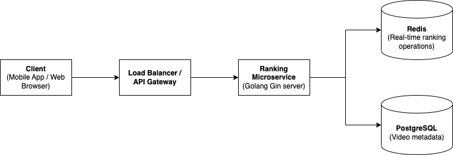

# Ranking Service

## High level architecture diagram



## Generate Swagger docs

```bash
./scripts/swagger.sh
```

Open web browser at `http://localhost:8080/docs/index.html` to view swagger docs.

## Run from source code

```bash
go run . server
```

## Run testing

### Unit test

```bash
cd tests

go test -v -run '^Test(UpdateVideoScoreHandler|GetGlobalTopVideosHandler|GetUserTopVideosHandler)$'
```

### Integration test

- First using docker compose to start full stack

Copy `.env.example` file to `.env`

```bash
docker compose up -d
```

- Run integration test cases

```bash
cd tests

go test -v -run '^TestIntegration_'
```

## Deploy using docker compose

- Copy `.env.example` file to `.env`

- Run docker compose

```bash
docker compose up -d
```

- Stop service

```bash
docker compose down --volumes
```

## Test APIs using Postman

### Test interaction

- Create new POST request in Postman with URL : `http://localhost:8080/videos/integration-video-1739076789/interaction`

- Body: type Raw JSON

```json
{
    "type":   "like",
    "weight": 0,
    "user_id": "integration-user-1"
}
```

### Test global top ranking

- Create new GET request in Postman with URL : `http://localhost:8080/videos/top?limit=10`

### Test user top ranking

- Create new GET request in Postman with URL : `http://localhost:8080/users/integration-user-1/videos/top?limit=10`

### Kubernetes deployment

[TODO]
